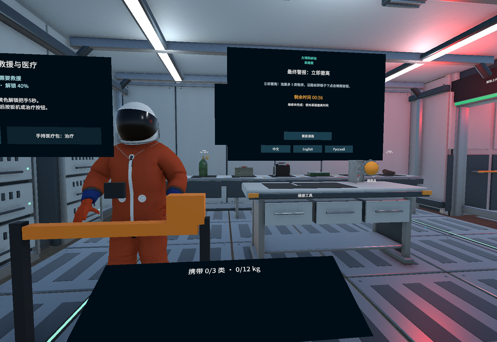
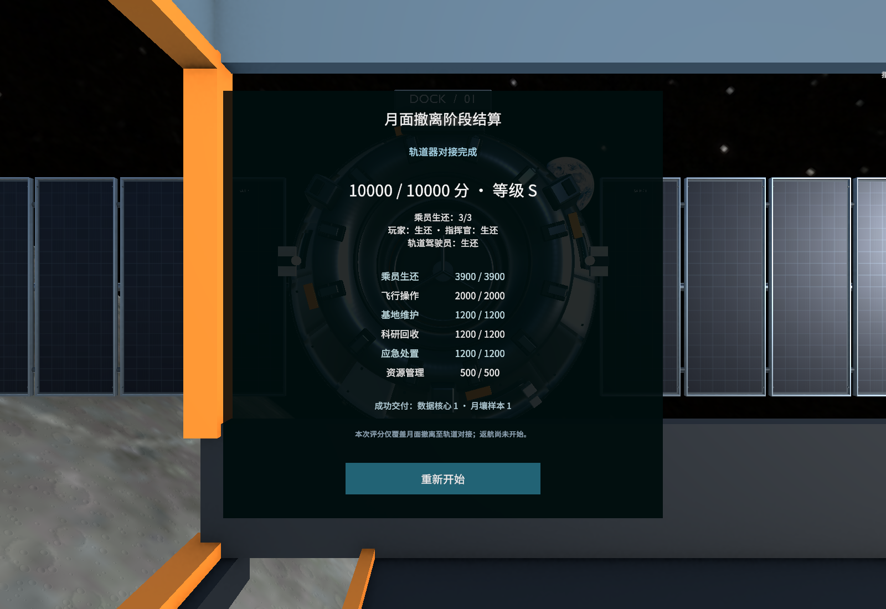

# 第十步：指挥官救援与阶段评分

本版继续使用主场景 `10_LunarStation_Docking`，在已有维修、撤离、上升和对接流程中加入真实的指挥官救援与阶段结算。范围到轨道器接口锁定；分数表示这段月面撤离任务的结果，不代表已经返航地球。04–09 教学场景保留原来的行为。

在 Unity 使用 `Lunar Escape → View Commander Rescue Version` 打开当前场景；如果从旧场景重新生成，执行 `Lunar Escape → Install Commander Rescue and Scoring` 安装本版组件与界面。正常试玩直接按 Play 开始，无需每次重新安装。

## 玩家要做什么

最终警报响起后，指挥官被困在基地内。到其身旁持续握住救援把手 5 秒可以解除障碍；松手暂停并保留进度。仅从远处用射线选中把手，或手伸过去而身体仍在远处，都不能代替到场救援。任务倒计时始终继续走，救援没有独立的暂停或额外时间。

受伤指挥官的生命值会继续下降。抓起真实的医疗包，把它贴近指挥官身上的医疗接口，然后按物品激活键或面板治疗按钮；使用后该物品从共享物资清单消耗。只在背包里有医疗包、让未抓取的医疗包碰到他，或从远处调用操作都不能治疗；同一个包不能反复使用。上船后，面板提供指挥官治疗操作，使用船上剩余的同一份医疗物资。给玩家和指挥官治疗需要作出取舍。

救援成功后，指挥官沿基地出口和月面路线跟随玩家。玩家必须带他来到登舱点附近再确认登舱；玩家直接走远、传送到舱门或自己先登舱，不会把留在基地的指挥官自动带上船。未撤出的指挥官会在基地爆炸时死亡。舱内乘员外观以实际登舱和存活状态显示。

## 状态、时钟与资源

`CrewMission` 分别记录玩家、指挥官和轨道器驾驶员的状态，指挥官经历准备、被困、跟随、已登舱、被留下、生还或死亡。飞行失败和成功对接会先完成三个人的结局，再生成评分。默认高速对接碰撞会危及轨道器驾驶员，其余撤离失败不会无故杀死仍在轨道器内的驾驶员。

地面和飞行仍分别由现有 `StationMission` / `AscentMission` 的实际时间步推进。乘员系统没有第二个 `Update` 任务时钟：救援、失血、跟随移动只接收规则层已经结算的步长。大时间步只给救援完成后的余时用于跟随；倒计时归零的同一步不能靠救援、治疗或登舱绕过失败。对接后资源和结果冻结，重试恢复人员、救援进度、物资和评分。

整舱供氧仍使用现有的一个氧气储备和泄漏速率。加入乘员状态没有再次按人数扣氧。指挥官生命值独立计算：默认修好氧气系统时为 80 点、每秒失血 0.06；未修好时为 55 点、每秒失血 0.2。医疗包恢复 40 点并止血。上述数值是游戏参数，集中在 `CrewConfig`，不是医学模拟。

## 10000 分如何产生

原开发方案列出的六项建议上限相加为 9600。本版把差额 400 分补到人员生命项，使六项真实合计为 10000，并保持救人优先。

| 分项 | 上限 | 本版依据 |
| --- | ---: | --- |
| 人员生还 | 3900 | 0 / 1 / 2 / 3 人生还分别为 0 / 500 / 1800 / 3900 分 |
| 飞行操作 | 2000 | 真实起飞 500、完成入轨修正 500、成功对接 1000 |
| 基地操作 | 1200 | 在维修阶段真实修复氧气系统 |
| 科研回收 | 1200 | 对接后仍装船的数据核心和月壤各 600；同类不重复刷分 |
| 应急处理 | 1200 | 解除指挥官被困 500、实际带其登舱 300、安全起飞余量最多 400 |
| 资源储备 | 500 | 成功对接后的供氧 150、电量 150、主燃料 100、RCS 100 |

安全起飞余量按相对配置的安全秒数线性计分并封顶。资源分参考余氧可支持 60 秒、电量 30、主燃料 10、RCS 25，各自按比例计分并封顶。必要治疗、补氧或修补本身不直接扣分。科研和储备分只有成功对接才计算；失败时即使物资仍在清单中，也不算已经转交轨道器。

`MissionScore` 只在地面失败、飞行失败或成功对接时创建一次不可变 `MissionScoreSnapshot` 与 `MissionScoreResult`。结果保留三名乘员状态、实际飞行里程碑、科研交付和剩余资源；读取界面或继续触发事件不会累加分数。重试清空本轮结果，旧的快照数据不随新任务改变。

## 实现边界

本版指挥官移动使用预设撤离路线与跟随距离，沿用现有乘员外观；它不是通用导航 AI，也没有增加完整行走骨骼动画。基地外观、月面细节与轨道器资产继续沿用上一版。新增救援、医疗和状态展示均通过已有 XR 与任务组件连接，没有移动玩家真实头显来代替操作。

实现文件：`Scripts/Crew/CrewConfig.cs`、`Scripts/Crew/CrewMission.cs`、`Scripts/Crew/GroundCrewController.cs` 与 `Scripts/Scoring/`。验证用例与最终运行记录见 [开发验证记录](验证记录.md)。

## 本版验证与画面

2026-10-07 在 Unity 6000.6.1f1 下完成全量 PlayMode **119/119 通过**，包含新增 10 项救援和评分验证。PC 渲染设置关闭 GPU Resident Drawer，以规避本机反复切换场景时出现的引擎原生崩溃；仍使用 SRP Batcher 和现有 LOD。尚未验证真实 VR 设备帧率与操作舒适性，详细结果和兼容处理见 [验证记录](验证记录.md) 与 [测试报告](crew-tests.xml)。

救援暂停在 40% 时，黄色把手、人物和操作面板同框；使用玩家眼位及 70° 检查相机，不改变游戏相机：

真实完成救援、维修、科研回收和对接后的三人生还结算：

其他验收画面：[舱内指挥官](Previews/crew-boarded.png)、[英文成功结算](Previews/crew-score-success-English.png)、[俄文成功结算](Previews/crew-score-success-Russian.png)、[碰撞失败结算](Previews/crew-score-collision-Chinese.png)。
